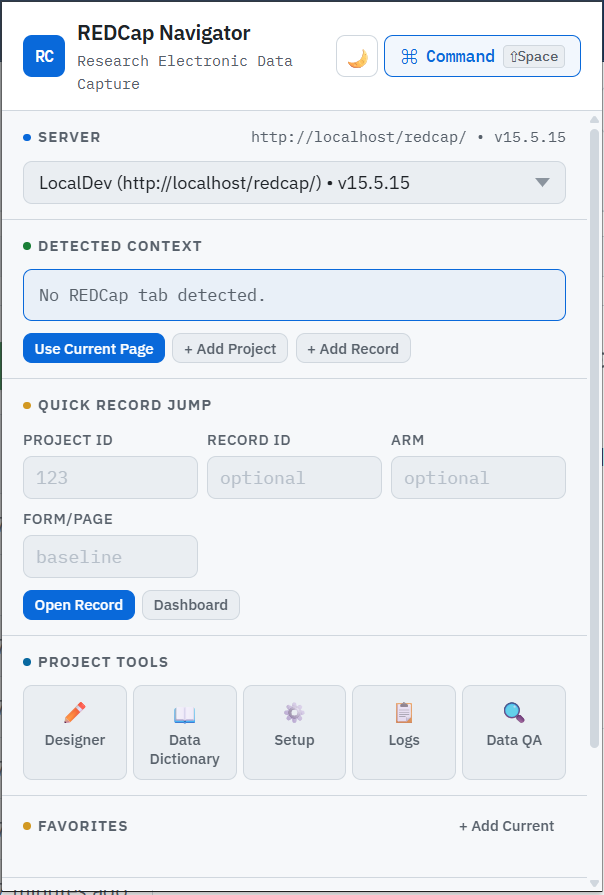

# REDCap Navigator

A Chrome extension that adds quick navigation tools for REDCap projects and records.

REDCap Navigator helps researchers, coordinators, analysts, and admins jump faster between project pages, records, reports, and common REDCap tools without repeatedly clicking through the REDCap interface.

 

## Features

- Open a REDCap project by Project ID
- Jump directly to a record by Project ID and Record ID
- Open record home / dashboard pages
- Quick links to common REDCap tools:
  - Online Designer
  - Codebook / Data Dictionary
  - Project Setup
  - Logging
  - Data Quality
- Save favorite projects
- Track and reopen recent records
- Command palette for fast keyboard-driven navigation
- Optional auto-detect of the current REDCap project / record context
- Configurable server and REDCap version support
- Optional reuse of the current tab instead of opening a new one
- Dark mode support

## Install steps:

1. Download the ZIP in releases
2. Extract it
3. Go to chrome://extensions
4. Enable Developer Mode
5. Click "Load Unpacked"
6. Select the folder

#### To Upgrade: follow the same steps as installing. "Export" your settings in "Options" first, so you do not lose your settings. ####

## Configure/Set Options (Do this upon first time installing!)
1. Right click on the icon in the browser (make sure the extension is pinned in your browser)
2. select options
3. Configure the extension to match your environment

## Why this extension

Working in REDCap often means moving between the same project pages and records over and over. This extension reduces that friction by giving you a lightweight popup for quick jumps and shortcuts.

## Example use cases

- Open Project `16`
- Open Record `1` inside Project `16`
- Jump to a report in Project `16`
- Open the current project’s Online Designer
- Save frequently used projects as favorites
- Reopen recent records without browsing through REDCap menus

## Command examples

Use the command palette to quickly navigate (if PID was 16):

- `16`
- `16 1`
- `16 1 baseline`
- `16 dashboard`
- `16 designer`
- `16 codebook`
- `16 setup`
- `16 logs`
- `16 dq`
- `16 report 5`

## Installation

### Load unpacked extension

1. Download or clone this repository
2. Open Chrome or Brave
3. Go to `chrome://extensions`
4. Enable **Developer mode**
5. Click **Load unpacked**
6. Select the extension folder

## Settings

You can configure:

- REDCap server URL
- REDCap version
- Favorites enabled / disabled
- Recent records enabled / disabled
- Auto-detect current REDCap context
- Reuse current tab instead of opening a new tab
- Theme preferences

## Who this is for

This extension is intended for people who regularly work in REDCap, including:

- Researchers
- Study coordinators
- Data managers
- Analysts
- REDCap administrators
- Support staff

## Privacy

This extension is designed to store user preferences, favorites, and recent items locally in browser storage. It is meant to help with navigation and does not require a remote backend service.

## Permissions

Depending on the build, the extension may use:

- `storage` for settings, favorites, and recent records
- `tabs` to open or reuse REDCap pages
- `scripting` to detect current REDCap context from the active REDCap tab
- host permissions for REDCap URLs so the extension can detect context on supported REDCap pages

## Project status

Active prototype / utility extension.

## Notes

This project is not affiliated with or endorsed by the REDCap Consortium or Vanderbilt University.
